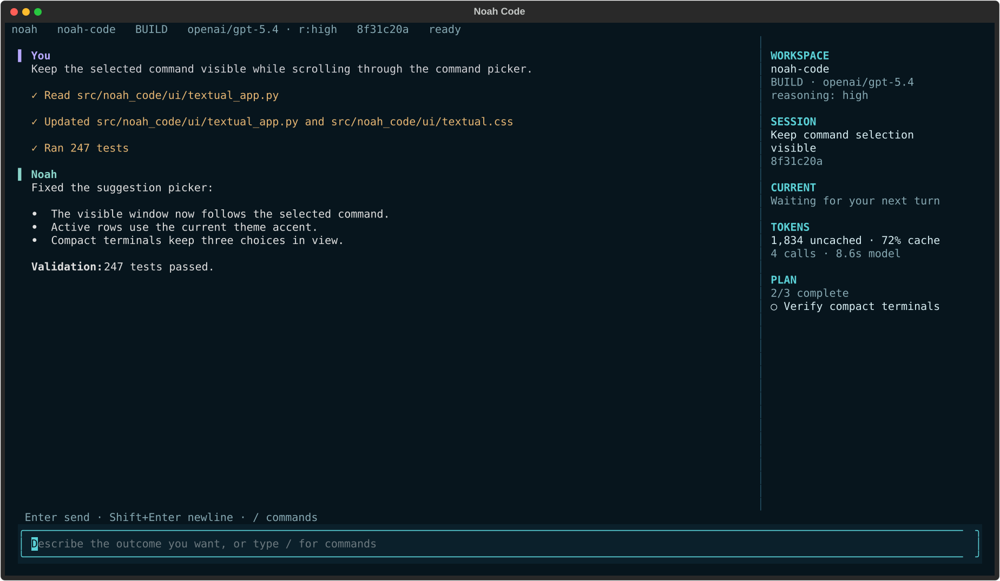

<div align="center">

# Noah Code

**A terminal coding harness built on NVIDIA's NOAA framework**

[](https://pypi.org/project/noah-code/)
[](https://github.com/skundu42/noah-code/actions/workflows/ci.yml)
[](https://pypi.org/project/noah-code/)

</div>



<p align="center"><sub>The real Textual interface, captured from a deterministic Noah Code session.</sub></p>

Noah keeps the conversation central while the context rail tracks the workspace, model, session,
token usage, and current plan. Tool execution stays visible, completed work compacts into readable
records, and every session remains scoped to its repository.

Built on the [NVIDIA OO Agents (NOOA)](https://github.com/NVIDIA-NeMo/labs-OO-Agents) runtime.

## Install

Install Noah Code and its managed Python runtime with one command:

```bash
curl -LsSf https://raw.githubusercontent.com/skundu42/noah-code/main/install.sh | sh
```

Open a new terminal, move into a repository, and start Noah:

```bash
cd your-project
noah .
```

Noah is compatible with macOS on Apple Silicon and Intel, plus Linux on arm64 and x86_64.

On the first launch, the TUI walks through provider, API key, model, and reasoning setup. Keys are
stored in Noah's private auth file with owner-only permissions; they are never written to project
configuration or session history.

## Why Noah

- **Repository-aware exploration.** Search with ripgrep, inspect Git history and diffs, navigate
  symbols through language servers, and use an mtime-cached repository map.
- **Controlled edits.** Apply anchored replacements or atomic multi-file patches with exact
  preimages, concurrent-change detection, immediate diagnostics, and rollback.
- **Visible execution.** Stream bounded shell output while commands run, keep servers and watchers
  as managed background jobs, and revisit activity details with `F2`.
- **Recoverable work.** Review staged and unstaged changes in `/diff`, then undo or redo journaled
  file edits even after restarting Noah.
- **Persistent sessions.** Resume repository-scoped conversations, todos, model choices, and
  automatically compacted context without losing the full underlying tool results.
- **Explicit control.** Switch between implementation-focused **build** mode and read-only
  **plan** mode, with ordered `allow`, `ask`, and `deny` permission rules.
- **Extensible workflows.** Add slash commands, opt-in skills, MCP servers, or markdown subagents;
  attach `@files` and images when the task needs more context.

Noah follows repository instructions from `AGENTS.md`, `CLAUDE.md`, and
`.noah-code/instructions.md`.

## Quick start

Describe the outcome you want rather than prescribing every edit:

```text
Find the cause of the failing parser tests, implement the smallest safe fix, and run the
focused test file.
```

Useful launch modes:

```bash
# Open another workspace
noah /path/to/repository

# Inspect and plan without editing
noah --mode plan .

# Run one task and exit
noah run "Explain how authentication is wired" .

# Allow actions that would normally ask; explicit deny rules still apply
noah run --auto "Fix the failing unit test" .

# Resume previous work
noah --continue .
noah --session SESSION_ID .

# Use the line-oriented interface
noah --console .
```

Check the installation and resolved configuration with:

```bash
noah --version
noah doctor .
noah config show .
noah update --check
noah benchmark .
```

The package also installs `noah-code` and `nc` as equivalent entry points. Because `nc` commonly
means netcat, `noah` or `noah-code` is recommended.

## Inside the TUI

Type `/` to search the full command and configuration reference. The most common controls are:

| Control | Action |
| --- | --- |
| `Enter` | Send the current prompt or accept a selected suggestion |
| `Shift+Enter` | Insert a newline |
| `Tab` | Switch between build and plan mode |
| `F2` | Open execution activity |
| `F3` | Open paginated conversation history |
| `/model` | Configure a provider or switch the session model |
| `/theme` | Choose Atom One Dark, Noah Ocean, Graphite, or High Contrast |
| `/diff` | Review staged and unstaged changes |
| `/undo` / `/redo` | Traverse the persistent edit journal |
| `/tokens` | Inspect tokens, cache usage, model wait, and tool output |
| `/efficiency` | Switch between `fast`, `balanced`, and `deep` budgets |

On wide terminals, the side rail keeps the active workspace, session, model, tokens, update state,
and plan in view. The main pane remains centered on the Noah mark until the first prompt, then
becomes the conversation and execution timeline.

## Models and providers

Noah supports OpenAI, Anthropic, OpenRouter, NVIDIA, and custom OpenAI-compatible providers. It
also works with vLLM, LM Studio, Ollama, Azure OpenAI, Bedrock, Gemini, Groq, Mistral, xAI,
DeepSeek, Together AI, and Perplexity.

The guided `/model` flow is the easiest way to configure a provider. Environment variables and
the CLI remain available for scripts and headless environments:

```bash
export OPENAI_API_KEY="..."  # or ANTHROPIC_API_KEY / OPENROUTER_API_KEY
noah providers list
noah providers add openai --model MODEL_NAME
noah .
```

`/model MODEL` changes only the current session and remembers that choice when resumed. Use
`/model --global MODEL` to set the default for future sessions in every repository.

For compatible reasoning models, choose `default`, `none`, `minimal`, `low`, `medium`, `high`, or
`xhigh`. `default` omits the provider parameter:

```bash
noah --model openai/MODEL --reasoning-effort high .
```

See the [provider configuration guide](docs/configuration.md#bring-your-own-api-provider) for
gateway-specific setup.

## Updates

Noah checks PyPI for new versions at most once every 24 hours. New TUI sessions show a temporary
banner when an update is available and keep the version visible in the context rail. Installation
remains explicit by default:

```bash
noah update --check
noah update
```

## Documentation

- [Interactive interface and sessions](docs/interactive-reference.md)
- [Configuration, modes, permissions, and updates](docs/configuration.md)
- [Generated-code security](docs/security.md)
- [Custom commands, skills, MCP, and tracing](docs/extensions.md)
- [Development, CI, and releases](docs/development.md)
- [Release notes](docs/releases/)

## Development

```bash
uv sync --extra dev --extra mcp --extra tracing
uv run ruff check src tests
uv run pytest tests
uv build
```

See the [development guide](docs/development.md) for platform checks and the release process.

## License

Apache-2.0. NOOA remains separately licensed by its upstream
project.

## Credits

Built on [NVIDIA OO Agents (NOOA)](https://github.com/NVIDIA-NeMo/labs-OO-Agents). Thanks to the
NVIDIA NeMo team and NOOA contributors for the agent runtime that powers Noah Code.
